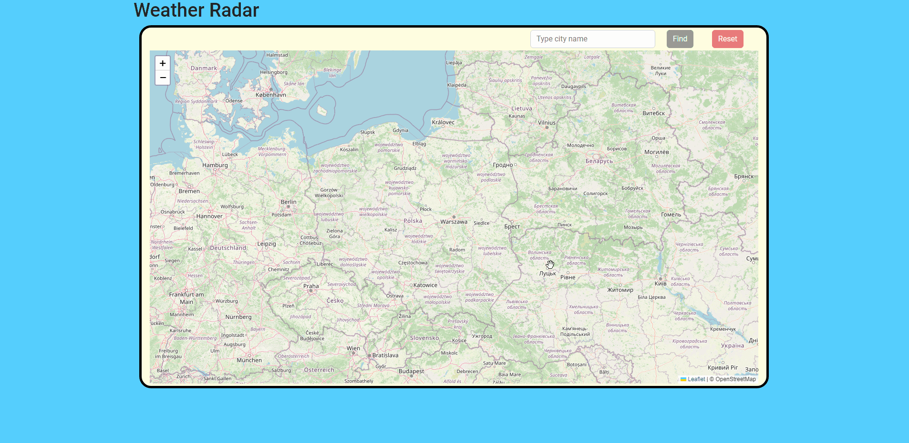
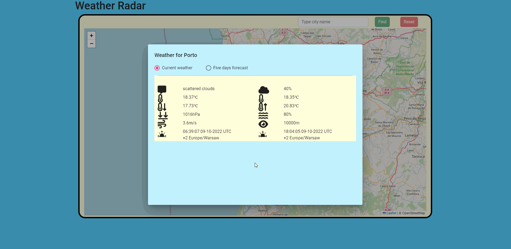
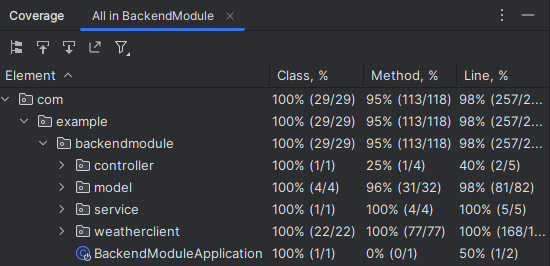

# About

Application for checking the current weather and forecast for any place on Earth.


# Functionalities

1. Checking the current weather for a given city name.
2. Checking the five-day forecast for a given city name.
3. Checking the current weather for a given point.
4. Checking the five-day forecast for a given point.
5. Presentation of data on a map.

# Technologies

## Backend

- Spring Boot / Java
- Maven
- AssertJ
- Mockito

## Frontend

- Angular
- Leaflet / OpenStreetMap

# API

The weather data is provided by [OpenWeatherMap.org](https://openweathermap.org/).

# How to run

## Backend

1. Get your API_KEY from the service [OpenWeatherMap.org](https://openweathermap.org/).
2. Assign your API_KEY to a variable ```configuration.weather-service.API_KEY=``` in the
   file ```WeatherRadar\BackendModule\src\main\resources\application-dev.properties```.
3. Run BackendModuleApplication class
   from ```WeatherRadar\BackendModule\src\main\java\com\example\backendmodule\BackendModuleApplication.java```.

## Frontend

1. Use terminal from project root and go to Angular module with command: ```cd .\FrontendModule\ ```.
2. Use command: ```ng serve``` to run the Angular module.

Default address of frontend server is  http://localhost:4200.

# Usage Example

Run http://localhost:4200/ in your browser.

### You don't need to use the search box. Just double-click the map in the place that interests you.


### Find current weather and forecast for city with search field.




### The icons have tooltips containing information about the field.



### You can easily change the search target, the answer is almost immediate.


# Tests

Application is covered by unit tests.
The screenshot presents you percentage coverage of these tests.



# Summary

Project was made to learning purposes.

I hope it will be useful to you, enjoy :3

Use freely.
